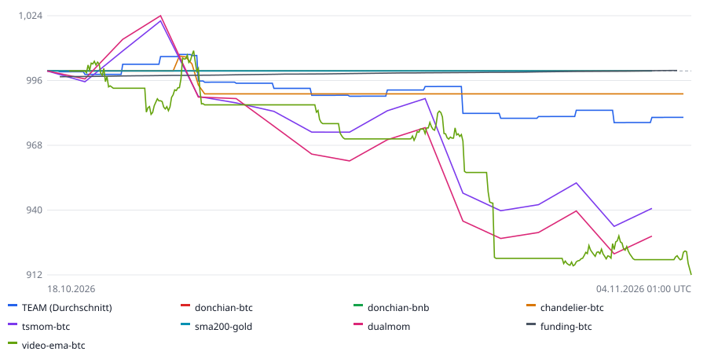

# 📈 Paper-Trading Dashboard

Stand: **08.11.2026 01:53 UTC** · Spielgeld, keine echten Trades · Start je Bot: 1.000,00 €

**Sicher: 3.000,00 €** (+0,00 % auf 3 Bots)  
**Krass: 3.000,00 €** (+0,00 % auf 3 Bots)  
größter Einbruch (Durchschnitt aller Gruppen-Bots): **0.0 %**

Vergleichs-Bots zählen in keiner Gruppe mit.

📅 **News-Filter** (keine neuen Einstiege 2 h vor bis 1 h nach): Tue 03.11. 15:16 UTC Congressional Elections · Fri 06.11. 13:30 UTC Average Hourly Earnings m/m · Fri 06.11. 13:30 UTC Non-Farm Employment Change · Fri 06.11. 13:30 UTC Unemployment Rate

📒 **[Trading-Journal](JOURNAL.md)** (Grund jedes Trades) · ✍️ **[Eigene Notizen](NOTIZEN.md)**

| Bot | Strategie | Markt | Konto | Ergebnis | Max. Einbruch | Trades | Treffer | Position | Status |
|---|---|---|---:|---:|---:|---:|---:|---|---|
| sicher-gold | Tagestrend (Sicher) | GC=F | 1.000,00 € | +0,00 % | 0.0 % | 0 | 0 % | wartet auf Trend | ✅ läuft |
| sicher-silber | Tagestrend (Sicher) | SI=F | 1.000,00 € | +0,00 % | 0.0 % | 0 | 0 % | wartet auf Trend | ✅ läuft |
| krass-gold | Tagestrend (Krass) | GC=F | 1.000,00 € | +0,00 % | 0.0 % | 0 | 0 % | wartet auf Trend | ✅ läuft |
| krass-silber | Tagestrend (Krass) | SI=F | 1.000,00 € | +0,00 % | 0.0 % | 0 | 0 % | wartet auf Trend | ✅ läuft |
| sicher-gold-4h | 4h-Trend (Sicher) | GC=F | 1.000,00 € | +0,00 % | 0.0 % | 0 | 0 % | wartet auf Trend | ✅ läuft |
| krass-gold-4h | 4h-Trend (Krass) | GC=F | 1.000,00 € | +0,00 % | 0.0 % | 0 | 0 % | wartet auf Trend | ✅ läuft |

## Letzte Trades

| Geschlossen | Bot | Einstieg | Ausstieg | Gewinn | Grund |
|---|---|---:|---:|---:|---|
| – | – | – | – | – | noch keine abgeschlossenen Trades |
